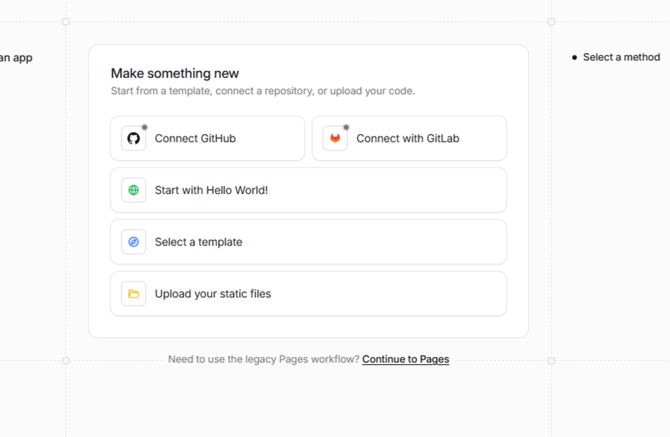
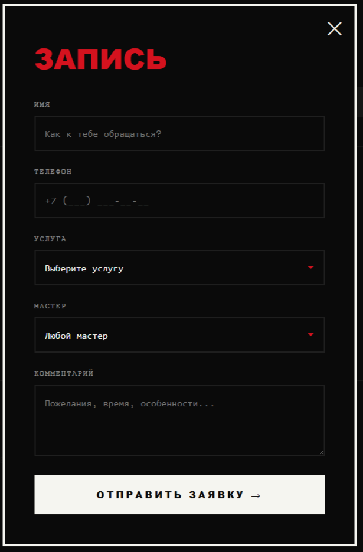
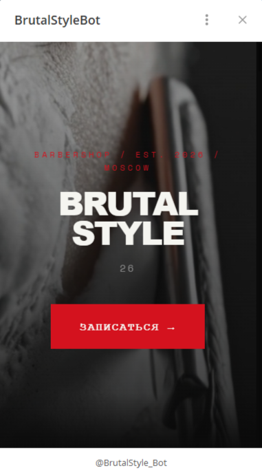
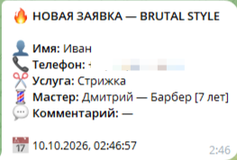

# 💈 BRUTAL STYLE — Барбершоп с Telegram-интеграцией

> Современный лендинг барбершопа с брутальным дизайном, автоматической отправкой заявок в Telegram и нативным Mini App внутри мессенджера.

**Live Demo:** https://alphastatex.github.io/barbershop/

---

## 📸 Скриншоты

| Главный экран          | Форма бронирования     |
| ---------------------- | ---------------------- |
|  |  |

| Mini App в Telegram            | Заявка в Telegram                              |
| ------------------------------ | ---------------------------------------------- |
|  |  |

---

## 🏗 Архитектура

### Почему Cloudflare Worker?

- 🔒 **Токен бота не виден в коде** — он живёт на сервере Cloudflare
- 🌍 **Обход блокировок РКН** — запросы идут через серверы Cloudflare
- ⚡ **Бесплатно** — до 100,000 запросов в день
- 🚀 **Быстро** — edge-серверы по всему миру

---

## 📱 Telegram Mini App

Сайт работает как **нативное приложение внутри Telegram**:

- 📱 Открывается по кнопке в боте (без перехода в браузер)
- 👤 **Имя пользователя подставляется автоматически** из Telegram-профиля
- 🔴 Нативная кнопка **MainButton** внизу экрана Telegram
- 🎨 Адаптируется под тёмную/светлую тему пользователя
- ⚡ Мгновенная загрузка (SDK инжектится самим Telegram)

### Как это работает:

1. Пользователь открывает бота и нажимает "Открыть барбершоп"
2. Telegram открывает сайт в своём встроенном браузере
3. SDK Telegram автоматически подставляется в страницу
4. Код в `app.js` определяет среду через `window.Telegram.WebApp`
5. Имя берётся из `tg.initDataUnsafe.user.first_name`
6. Главная кнопка Telegram привязывается к отправке формы

---

## 🛠 Стек технологий

| Категория          | Технологии                                          |
| ------------------ | --------------------------------------------------- |
| **Frontend**       | HTML5, CSS3, Vanilla JavaScript                     |
| **Типизация**      | TypeScript через JSDoc (`@ts-check`) + `types.d.ts` |
| **Тесты**          | Vitest (юнит) + Playwright (E2E)                    |
| **Линтинг**        | Biome                                               |
| **Форматирование** | Prettier                                            |
| **Деплой**         | GitHub Pages                                        |
| **Бэкенд**         | Cloudflare Workers (прокси)                         |
| **API**            | Telegram Bot API + Telegram Web App SDK             |

---

## ✨ Ключевые фичи

### 🎨 Дизайн

- **Брутализм** — чёрный фон, красный акцент, моноширинный шрифт Space Mono
- **Кастомный курсор** — ножницы с анимацией "snip" при клике
- **Scroll-reveal анимации** — элементы появляются при скролле
- **Parallax-эффекты** — глубина на hero-секции
- **Счётчики** — анимированный подсчёт статистики

### 📋 Функционал

- **12 мастеров** с подробными профилями в модалках
- **Фильтрация** — кнопка "Показать всех 12 мастеров"
- **Форма бронирования** с:
  - Маской телефона `+7 (XXX) XXX-XX-XX`
  - Валидацией всех полей
  - Выбором услуги и мастера
- **Telegram-уведомления** — заявка приходит мгновенно
- **Mini App** — сайт работает внутри Telegram

### 🧪 Качество кода

- **13 автотестов** (7 юнит + 6 E2E)
- **Строгий линтинг** через Biome
- **JSDoc типизация** для TypeScript-совместимости
- **Модульная архитектура** — чистые функции в `utils.js`
- **Собственные типы** (`types.d.ts`) для внешних SDK

---

## 🔑 Ключевые решения

### 1. Безопасное хранение токена

Токен бота **никогда не попадает в репозиторий**. Он хранится в Cloudflare Worker, а фронтенд общается только с прокси-URL.

### 2. Обход блокировок РКН

Домен `api.telegram.org` заблокирован в РФ. Cloudflare Worker выступает прокси — запросы идут через серверы Cloudflare, которые не заблокированы.

### 3. Динамическая загрузка Telegram SDK

SDK не подключается через `<script>` (это вызвало бы таймаут в РФ). Вместо этого код проверяет `window.Telegram` — если сайт открыт внутри Telegram, SDK уже там (Telegram инжектит его сам).

### 4. Типизация без TypeScript

Использован `@ts-check` + `types.d.ts` вместо полноценного TS-проекта. Это даёт проверку типов без необходимости компиляции.

---

## 🚀 Быстрый старт

```bash
# Клонировать репозиторий
git clone https://github.com/alphastatex/barbershop.git
cd barbershop

# Установить зависимости
npm install

# Запустить локально
npx serve .

# Запустить тесты
npm test          # Vitest
npm run e2e       # Playwright

# Линтинг
npx @biomejs/biome check .
barbershop/
├── index.html              # Разметка
├── styles.css              # Стили (брутализм)
├── app.js                  # Основная логика + Telegram Mini App
├── utils.js                # Чистые функции (маска телефона)
├── utils.test.js           # Юнит-тесты
├── types.d.ts              # Типы для Telegram Web App SDK
├── tsconfig.json           # Конфиг TypeScript для JSDoc
├── tests/
│   └── smoke.spec.js       # E2E-тесты Playwright
── docs/                   # Скриншоты для README
├── biome.json              # Конфиг линтера
├── vitest.config.js        # Конфиг Vitest
├── playwright.config.js    # Конфиг Playwright
└── package.json
Полезные ссылки
Live Demo: https://alphastatex.github.io/barbershop/
Cloudflare Worker: https://tg-barbershop-proxy.alphastatex.workers.dev
Документация Telegram Web App: https://core.telegram.org/bots/webapps
Документация Cloudflare Workers: https://developers.cloudflare.com/workers/
MIT © 2026 alphastatex
```
